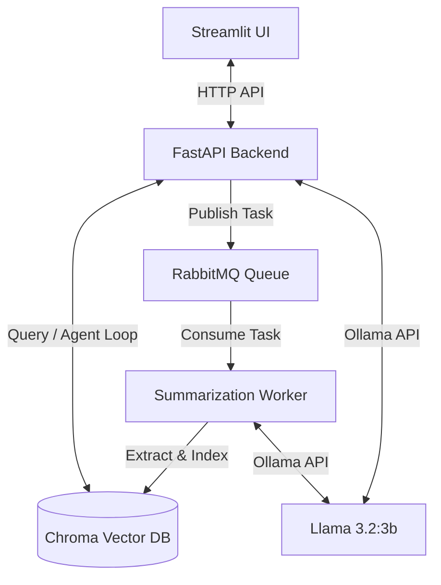

# Agentic Company FAQ & Document QA RAG System

An advanced agentic Retrieval-Augmented Generation (RAG) system that allows users to ask questions from company FAQs and uploaded documents. Built using a robust microservice architecture with asynchronous file processing, query routing, tool-use loops, and self-correction reflection.

---

## 🏗️ Architecture Overview

The system is decoupled into a fast, non-blocking API gateway and an asynchronous task-driven worker, communicating via a RabbitMQ message broker.



---

## 🌟 Key Features

### 1. Asynchronous Document Ingestion
- Upload multiple PDFs, text, or office files simultaneously.
- FastAPI saves the files and publishes extraction tasks to RabbitMQ instantly, keeping the UI highly responsive.
- A background python worker extracts text, generates document summaries, and indexes chunks into Chroma DB.

### 2. Query Routing Agent
- Classifies incoming queries into `GREETING`, `FAQ`, `DOCUMENT`, or `OTHER`.
- Conversation-only prompts (e.g. "Hi") and out-of-scope queries (e.g. general knowledge) bypass database scans entirely to save processing latency.

### 3. ReAct Reasoning Loop (Tool-Use)
- Gives the LLM tools (`Search_FAQ` and `Rewrite_Query`) to formulate semantic search queries.
- Runs a multi-turn Reasoning and Acting loop to decide what information it needs before answering.

### 4. Self-Correction & Reflection Loop
- **Relevance Checker**: Evaluates retrieved chunks. If irrelevant, it automatically rewrites the query and executes search again.
- **Grounding Auditor**: Audits generated draft responses against original text sources to detect hallucinations. If flagged, it automatically regenerates the response under strict grounding constraints.

### 5. Context-Aware Memory
- Uses active conversation history logs to resolve ambiguous follow-up queries (e.g., rewriting *"Summarize it"* to *"Summarize Improving DES Security.pdf"*).

---

## 🛠️ Technology Stack
- **Core Orchestration**: Python 3.11, LangChain
- **Backend API**: FastAPI, Uvicorn, Pydantic
- **Frontend App**: Streamlit
- **Vector Database**: Chroma DB
- **Embeddings Model**: HuggingFace Sentence Transformers (`all-MiniLM-L6-v2`)
- **Local LLM**: Ollama (`llama3.2:3b`)
- **Message Queue**: RabbitMQ, Pika

---

## 🚀 Getting Started

### Prerequisites
1. **Ollama**: Install [Ollama](https://ollama.com/) and run:
   ```bash
   ollama pull llama3.2:3b
   ```
2. **RabbitMQ**: Ensure a local RabbitMQ server instance is installed and running on default port `5672`.

### Installation
1. Setup a virtual environment:
   ```bash
   python -m venv .venv
   .venv\Scripts\activate
   ```
2. Install the dependencies:
   ```bash
   pip install -r requirements.txt
   ```

### Execution Steps
Run the components in the following order (using separate terminals):

1. **Ingest Base FAQs** (Index the initial company FAQs):
   ```bash
   python ingest.py
   ```
2. **Start the Background Worker**:
   ```bash
   python workers/summarization_worker.py
   ```
3. **Start the FastAPI Backend**:
   ```bash
   uvicorn api:app --reload
   ```
4. **Start the Streamlit UI**:
   ```bash
   python -m streamlit run app.py
   ```

---

## 🧪 Running Unit Tests
A full test suite is provided to verify RAG pipelines, uploads, async tasks, routing, and self-correction.

Run tests using `pytest`:
```bash
pytest
```
