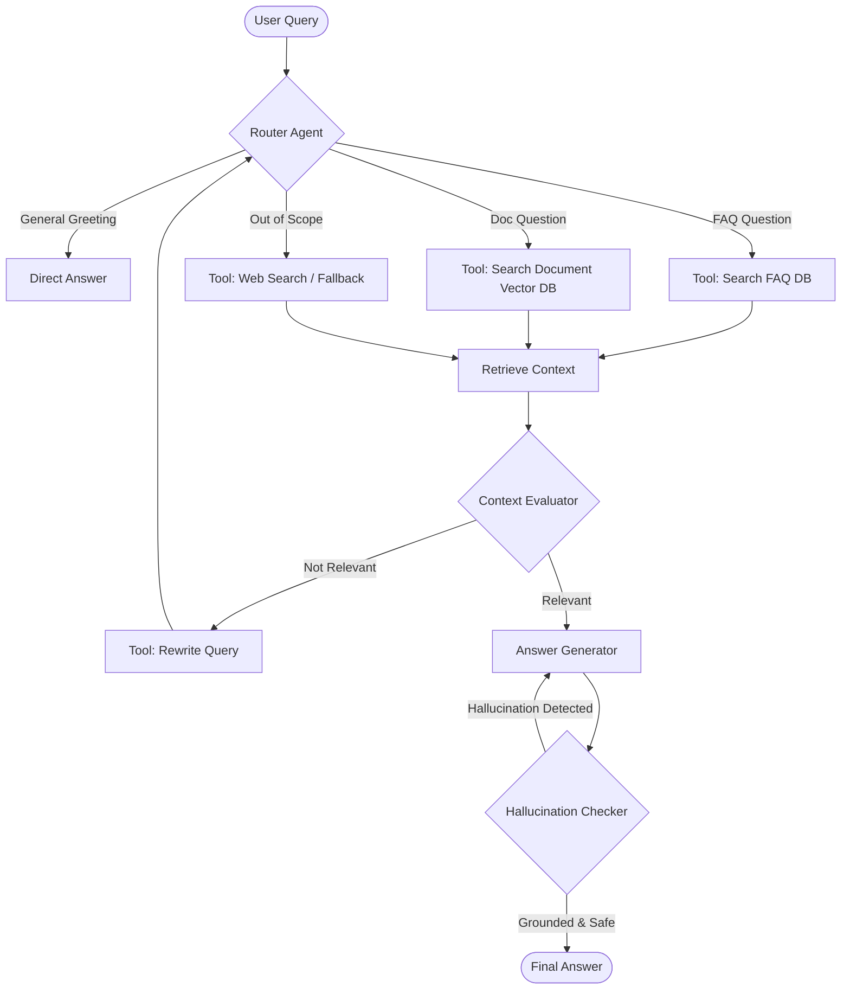

# Proposal: Evolving from Standard RAG to an Agentic AI System

This document outlines concrete suggestions, architectural blueprints, and a workflow execution plan to introduce **Agentic AI Features** into the existing Company FAQ RAG project.

---

## 1. Core Agentic Concepts for this Project

A standard RAG pipeline is **passive** (Retrieve $\rightarrow$ Generate). An **Agentic RAG** system is **active and autonomous**, executing reasoning loops, calling specialized tools, rewording search queries, and self-correcting responses.

---

## 2. Implemented & Proposed Agentic Features

### Feature A: Query Routing Agent [STATUS: IMPLEMENTED]
* **Purpose**: Instead of searching both FAQs and documents simultaneously for every query, a router agent evaluates the query first and directs it to the appropriate data retriever or direct action.
* **Implementation**:
  - A classifier prompt determines if the query is a greeting, a question about company policies (FAQ), a question about uploaded documents, or a general knowledge query.
  - Bypasses vector database searches entirely for greetings and general query categories, saving lookup resources.

### Feature B: Tool-Use / Function Calling & ReAct Loop [STATUS: IMPLEMENTED]
* **Purpose**: Provide the LLM with a set of tools it can call dynamically to formulate search strategies.
* **Implemented Tools**:
  - `Search_FAQ(query: str)`: Searches the FAQ database.
  - `Search_Document(query: str)`: Searches the selected document.
  - `Rewrite_Query(query: str)`: Re-formulates complex or vague queries to improve semantic retrieval.
* **Reasoning Loop**:
  - A ReAct loop (up to 2 turns) prompts the LLM to decide which tools to run, evaluates the returned context, and decides whether it has sufficient information to produce the final answer.

### Feature C: Self-Correction Loop (Reflection) [STATUS: IMPLEMENTED]
* **Purpose**: Eliminate hallucinations and guarantee that answers are strictly grounded in retrieved document chunks.
* **Implementation Details**:
  - **Context Relevance Assessment**: Evaluates retrieved chunks via `check_context_relevance`. If flagged as irrelevant, rewrites the query and executes search again.
  - **Grounding Audit (Hallucination Checker)**: Runs `audit_answer` to compare final drafted response claims against source text. If a hallucination is detected, it automatically regenerates the response using strict context-grounded constraints.

### Feature D: Context-Aware Conversational Memory [STATUS: IMPLEMENTED]
* **Purpose**: Utilize the message logs in `memory.py` to allow the LLM to follow multi-turn conversations (e.g., handling pronouns or relative references).
* **Implementation Details**:
  - **Memory-Based Query Reformulator**: Added `reformulate_question_with_memory` which passes the conversation history logs to the LLM to rewrite ambiguous user queries containing pronouns or relative references (e.g., rewriting `"Summarize it"` to `"Summarize Improving DES Security.pdf"`) before execution.

---

## 3. Workflow Execution Plan Status

### Completed
* **Phase 1: Contextual Query Classifier & Router**: Added classifier to check greeting and out-of-scope intents.
* **Phase 2: Tool-Calling Loop (ReAct Framework)**: Integrated Python functions for FAQ search, document search, and query rewriting, and built a ReAct reasoning loop.
* **Phase 3: Reflection & Guardrails**: Added relevance verification checks and automated grounding auditor to check responses and correct hallucinations in real-time.
* **Phase 4: Memory Integration**: Integrated memory-based query reformulation to decode multi-turn conversational queries.

